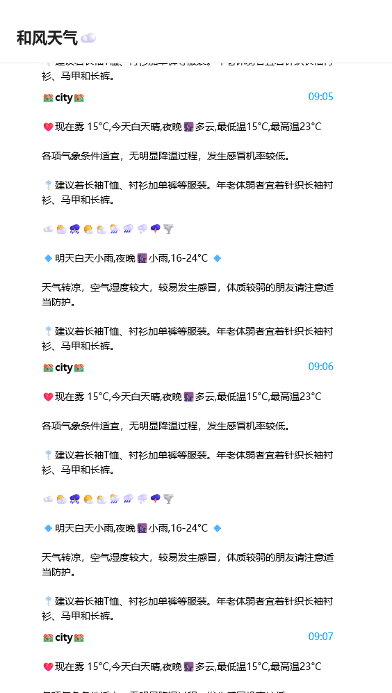

# 前言
- [和风天气小棉袄bot](https://t.me/he_weather_bot)故障
- 代码全部基于Gemini AI
- 没有恶劣天气预警

# 必须
- 注册[和风开发者](https://console.qweather.com),创建应用获取和风api,在设置里找到api host`形如 *.qweatherapi.com`
- 搜索[和风天气](https://www.qweather.com/)中所在城市的城市id,  `https://www.qweather.com/weather/beijing-101010100.html`中的`101010100`就是城市id
- 注册cloudflare
- 注册telegram获得[bot token](https://t.me/BotFather)和[用户chatid](https://t.me/userinfobot)

# 使用方式
- cloudflare创建worker,将项目的[worker.js](./worker.js)内容粘贴到新建的worker中
- 补全上述提到的5个必须项
- 保存部署后进入worker设置创建触发事件`cron`,填入表达式 `0 2 * * *` 和 `0 10 * * *` 
- 如此一来在UTC时间2点和10点将触发tg天气消息,即UTC+8的10点和18点

